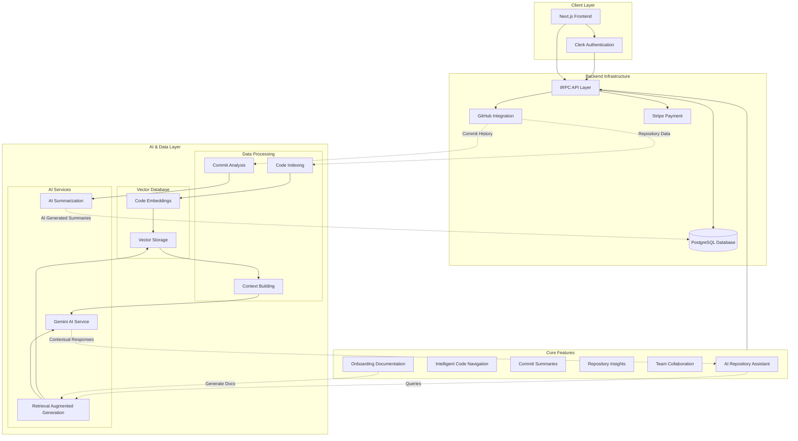

# Repolix: AI-Powered GitHub Repository Assistant

Repolix is a modern web application that transforms your GitHub workflow with AI-powered insights and repository analysis. It helps developers save time on code reviews, understand repositories faster, and collaborate more effectively.

## 🚀 Features

- **AI Repository Assistant**: Ask questions about your codebase to get instant, contextual answers
- **Intelligent Code Navigation**: Find and understand code faster with AI-powered search
- **Commit Summaries**: Automatically generate summaries of code changes
- **Repository Insights**: Get deep analytics and metrics on your projects
- **Team Collaboration**: Invite team members to work together on projects
- **Onboarding-Documentation**: Generate and maintain documentation that stays up-to-date for new joiners

## 📊 Technology Stack

Repolix is built with the [T3 Stack](https://create.t3.gg/), featuring:

- **[Next.js](https://nextjs.org)** - React framework with server-side rendering
- **[Clerk](https://clerk.dev)** - Authentication and user management
- **[Prisma](https://prisma.io)** - Type-safe ORM for database operations
- **[PostgreSQL](https://www.postgresql.org/)** - Database with vector extension for embeddings
- **[tRPC](https://trpc.io)** - End-to-end typesafe API
- **[Tailwind CSS](https://tailwindcss.com)** - Utility-first CSS framework
- **[Framer Motion](https://www.framer.com/motion/)** - Animation library
- **[Gemini AI](https://ai.google.dev/)** - Google's generative AI model
- **[Stripe](https://stripe.com)** - Payment processing

## 🏗️ System Architecture



## 🚀 Getting Started

### Prerequisites

- Node.js 18+ and npm/bun
- PostgreSQL database with vector extension
- GitHub OAuth application

### Installation

1. Clone the repository
   ```bash
   git clone https://github.com/yourusername/repolix.git
   cd repolix
   ```

2. Install dependencies
   ```bash
   npm install
   # or
   bun install
   ```

3. Set up environment variables
   ```bash
   cp .env.example .env
   # Edit .env with your configurations
   ```

4. Set up the database
   ```bash
   npm prisma db push
   # or
   bun prisma db push
   ```

5. Start the development server
   ```bash
   npm run dev
   # or
   bun dev
   ```

## 📚 Learn More

- [T3 Stack Documentation](https://create.t3.gg/)
- [Next.js Documentation](https://nextjs.org/docs)
- [Prisma Documentation](https://www.prisma.io/docs)
- [tRPC Documentation](https://trpc.io/docs)
- [Clerk Documentation](https://clerk.dev/docs)

